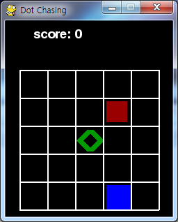
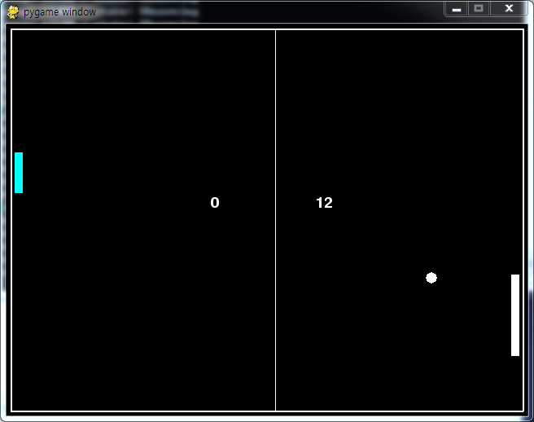
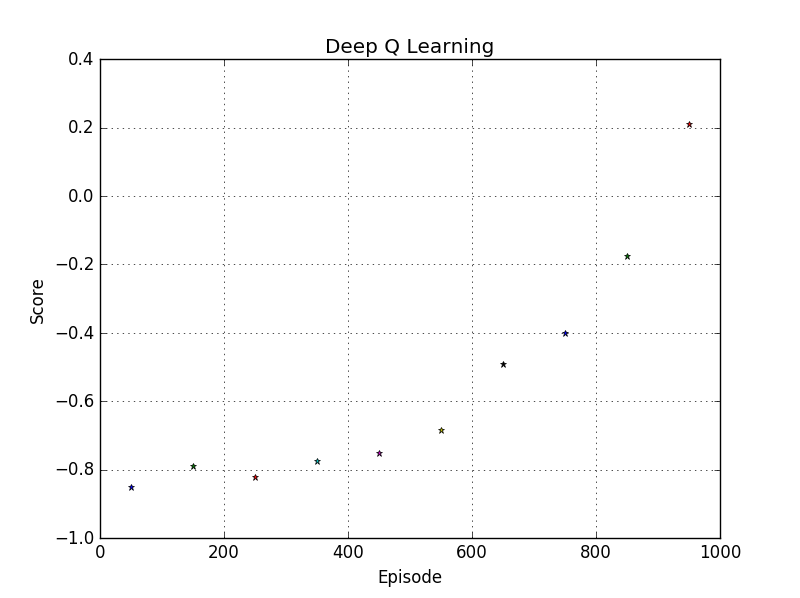
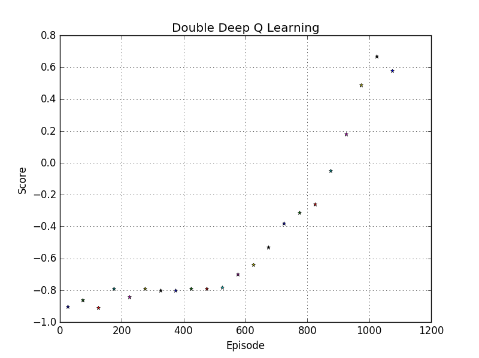

# DRL

## Introduction
This repository is the codes for `Deep Reinforcement Learning`
<br> I verified my codes with games. The games are made with `pygame`. I made some of the game codes and others are from other githubs. 
<br> I set up the DQN code as follows. 
* Deep Q Network
* Double Deep Q Network

---
## Environment
**Software**
* Windows7 (64bit)
* Python 3.5.2
* Anaconda 4.2.0
* Tensorflow 1.0.1
* pygame 1.9.3
* opencv3 3.1.0

**Hardware**
* CPU: Intel(R) Core(TM) i7-4790K CPU @ 4.00GHZ
* GPU: GeForce GTX 1080
* Memory: 8GB

---
## Implementation
1. Change the as game to the game that you want to implement
```
import pong as game
import dot  
import dot_test 
import tetris 
```

2. Choose the number of action of the game
```
#Action Num
#pong = 3
#dot, dot_test = 4
#tetris = 5

Num_action = 3
```
3. Set the name of the game to save the variables
```
game_name = 'pong'
```

4. Please check that you made the folder for saved variables
```
checkpoint = tf.train.get_checkpoint_state("saved_networks_DQN")
```

Then you are ready to implement the code! :laughing:

---
## Games 
To verify the codes, I used the games as follows. 
* dot 
* dot test 
* tetris
* pong 
* wormy

**Dot**
<p align= "center">
  
</p>

I made this game to evaluate my DQN code. 
<br>Rule is very simple. Blue square is agent, Red square is enemy(- reward), Green diamond is food(+ reward)
<br>So blue square needs to evade red square and get the green diamond. 
<br>You can change the difficulty and maps in the code. 

**Dot mini**
<p align= "center">
  
</p>

This is simple version of Dot. 

**Pong**
<p align= "center">
  
</p>

This is `Pong game` which is one of the most famous DRL example.
<br> Wrapped version of game code is from [github of asrivat1](https://github.com/asrivat1/DeepLearningVideoGames)

**Tetris**
<p align= "center">
  
</p>

Original tetris game code is from [invent with pygame](http://inventwithpython.com/pygame) 
<br>Wrapped version of game code is from [github of asrivat1](https://github.com/asrivat1/DeepLearningVideoGames)

**Wormy**
<p align= "center">
  
</p>

Original tetris game code is from [invent with pygame](http://inventwithpython.com/pygame) 
<br> I made wrapped version of game code my own


---
## Deep Q Network (DQN)

I studied `Deep Q Network` with the famous paper [Human-level control through deep reinforcement learning](http://www.nature.com/nature/journal/v518/n7540/full/nature14236.html) from Deep mind and `deep q network code` from [github of asrivat1](https://github.com/asrivat1/DeepLearningVideoGames).
<br> After, I studied DQN and made my own code. 
<br> I verified the code with the game `pong`. 
<br> The result graph is as follows. 

<p align= "center">
  
</p>

Each point is the average score of 100 games. 
<br> The graph shows that as the training progresses, the average score increases.
<br> I think it shows that DQN algorithm works well. :smiley: 

---
## Double Deep Q Network (DDQN)

I studied `Double Deep Q Network` with the paper [Deep Reinforcement Learning with Double Q-learning](https://arxiv.org/abs/1509.06461)
> The main idea of this algorithm is from `Double Q Learning` (van Hasselt,
> 2010).
> This algorithm uses two sets of weights, θ and θ'.
> <br> For each update, one set of weights (θ) is used to determine the greedy policy and the other (θ') is to determine its value.
> <br> The paper said, we can decouple the `selection` from the `evaluation` with this method.
> <br> This makes less likely to select overestimated values. 

<br> As a result, the difference between DQN and DDQN at each update is as follows.
<p align= "center">
  
</p>
<p align= "center">
  
</p>

<br> I verified the code with the game `pong`. 
<br> The result graph is as follows. 

<p align= "center">
  
</p>

This result shows better performance than DQN algorithm.


