# DRL

## Introduction
This repository is the codes for `Deep Reinforcement Learning`
<br> I verified my codes with games. The games are made with `pygame`. I made the games or I modified them to apply for DRL.
<br> I set up the DQN code as follows. 
* [Human-level Control Through Deep Reinforcement Learning](https://storage.googleapis.com/deepmind-media/dqn/DQNNaturePaper.pdf)
* [Deep Reinforcement Learning with Double Q-Learning](https://arxiv.org/abs/1509.06461)
* [Prioritized Experience Replay](https://arxiv.org/abs/1511.05952) 
* [Dueling Network Architecture for Deep Reinforcement Learning](https://arxiv.org/abs/1511.06581)
* [Deep Recurrent Q-Learning for Partially Observable MDPs](https://arxiv.org/abs/1507.06527) 


This is the [PPT file](https://www.dropbox.com/s/0o72oqe7f5kip4z/DQN.pdf?dl=0) for the `description of DQN codes` that I implemented. 

---
## Environment
**Software**
* Windows7 (64bit)
* Python 3.5.2
* Anaconda 4.2.0
* Tensorflow-gpu 1.3.0
* pygame 1.9.3
* opencv3 3.1.0

**Hardware**
* CPU: Intel(R) Core(TM) i7-4790K CPU @ 4.00GHZ
* GPU: GeForce GTX 1080
* Memory: 8GB

---
## Implementation
The sample code for my environment is `Environment_sample.py`

```python
# This is sample code for Deep Reinforcement Learning testing environment 

# Import modules
import sys 
import numpy as np
import random

# Import games
sys.path.append("DQN_GAMES/")

# add as game the one that you want to play!! 
import pong as game
import dot  
import dot_test  
import tetris  
import wormy
import breakout

# Get Number of action and name of game from the game code
Num_action = game.Return_Num_Action()
game_name = game.ReturnName()

# Get game state class from game code
game_state = game.GameState()

while True:
    # Choose random action
    action = np.zeros([Num_action])
    action[random.randint(0, Num_action - 1)] = 1.0

    # You can get next observation, reward and terminal after action
    observation_next, reward, terminal = game_state.frame_step(action)
```

You can run the game with random action using this code!! 


Please check that you made the folder for saved variables

```
checkpoint = tf.train.get_checkpoint_state("saved_networks_DQN")
```

Then you are ready to implement the code! :laughing:

---
## Games 
Most of the games are made with python and pygame! 

The codes are easy to understand and variables are easy to understand. 

So fix the code as you want!! :laughing: 

To verify the codes, I used the games as follows. 

* pong (Improved!! :satisfied:) 
* break out (New!! :smiley:) 
* tetris
* wormy
* dot
* dot test   
  ​

**Pong**
<p align= "center">
  
</p>

This is `Pong game` which is one of the most famous DRL example.
I write this code with pygame. 


Rule

- Red bar: Agent  /  Blue bar: Enemy
- Actions: Up, Down, Stay (3 actions)
- Enemy never lose the game! 
- If agent hit the ball, get +1 reward / If agent lose, get -1 reward
- If agent hit the ball 10 times then game is finished


**Break out**
<p align= "center">
  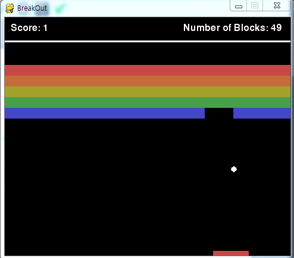
</p>

This is `Break out` which is one of the most famous DRL example.
I write this code with pygame. 


Rule

- Red bar: Agent  /  Blue bar: Enemy

- Actions: left slow, left fast, Stay, right slow, right fast (5 actions)

- If agent hit the ball, get +0.5 reward

- If ball breaks one block, get +1 reward

- If ball get to the ground, get -1 reward

- If agent breaks all of the blocks get +10 points!!

  ​

**Tetris**
<p align= "center">
  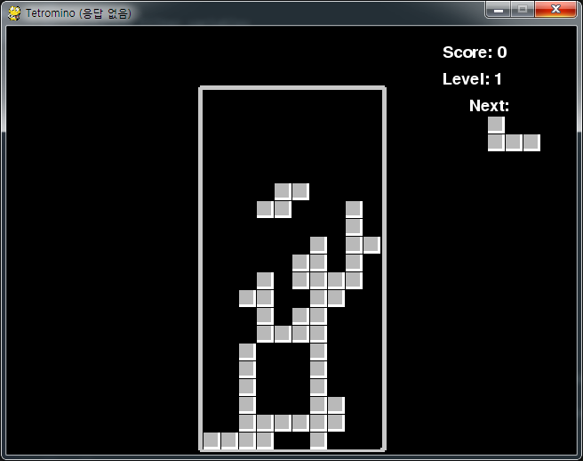
</p>

Original tetris game code is from [invent with pygame](http://inventwithpython.com/pygame) 
<br>Wrapped version of game code is from [github of asrivat1](https://github.com/asrivat1/DeepLearningVideoGames)


Rule

- Simple tetris rule!

- Actions: right, left, down, down to bottom, rotate 90 degree, rotate -90 degree (6 actions)

- If make one complete line then get +1 reward / Setting - reward is still in progress

  ​

**Wormy**
<p align= "center">
  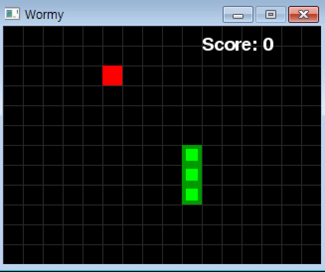
</p>

Original tetris game code is from [invent with pygame](http://inventwithpython.com/pygame) 
<br> I made DQN version of game code my own


Rule

- Simple wormy rule!

- Actions: right, left, forward (3 actions)

- If worm eat apple(red square) then gets +1 reward. 

- If worm hit the wall or eat himself gets -1 reward

  ​

**Dot**
<p align= "center">
  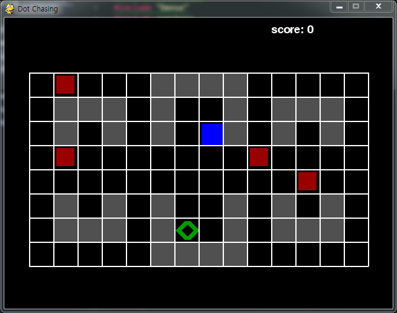
</p>

I made this game to evaluate my DQN code. 
<br>Rule is very simple. Blue square is agent, Red square is enemy(- reward), Green diamond is food(+ reward)
<br>So blue square needs to evade red square and get the green diamond. 
<br>You can change the difficulty and maps in the code. 


**Dot mini**
<p align= "center">
  
</p>

This is simple version of Dot. 

---
## Deep Q Network (DQN)

I studied `Deep Q Network` with the famous paper [Human-level control through deep reinforcement learning](http://www.nature.com/nature/journal/v518/n7540/full/nature14236.html) from Deep mind and `deep q network code` from [github of asrivat1](https://github.com/asrivat1/DeepLearningVideoGames).
After, I studied DQN and made my own code. 


<br> I verified the code with the game `breakout`. 

The graph of average score is as follows.

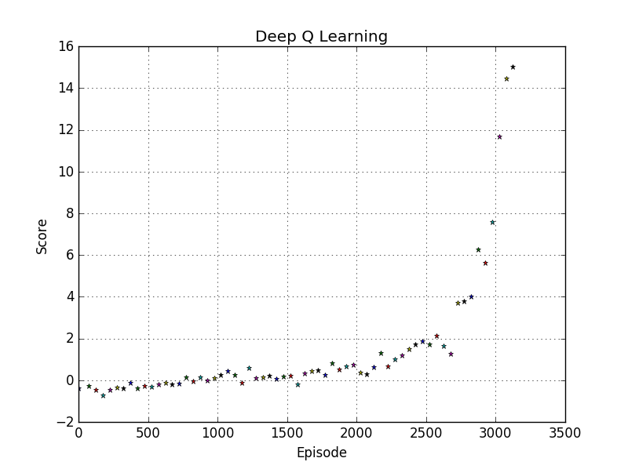

<br> The `average testing score is 18.43`


Each point is the average score of 50 games. 
<br> The graph shows that as the training progresses, the average score increases.
<br> I think it shows that DQN algorithm works well. :smiley: 

Also, the `average testing score is 18.43`

---
## Double Deep Q Network (DDQN)

I studied `Double Deep Q Network` with the paper [Deep Reinforcement Learning with Double Q-learning](https://arxiv.org/abs/1509.06461)
> The main idea of this algorithm is from `Double Q Learning` (van Hasselt, 2010).
> This algorithm uses two sets of weights, θ and θ'.
> <br> For each update, one set of weights (θ) is used to determine the greedy policy and the other (θ') is to determine its value.
> <br> The paper said, we can decouple the `selection` from the `evaluation` with this method.
> <br> This makes less likely to select overestimated values. 

<br> As a result, the difference between DQN and DDQN at each update is as follows.
<p align= "center">
  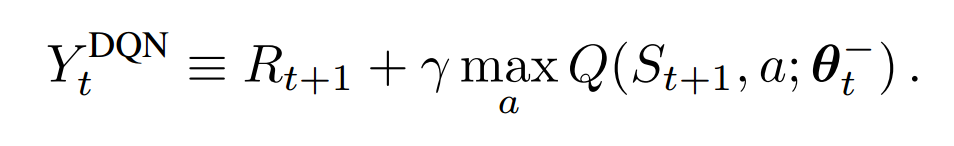
</p>
<p align= "center">
  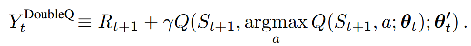
</p>

<br> I verified the code with the game `breakout`. 

The graph of average score is as follows.

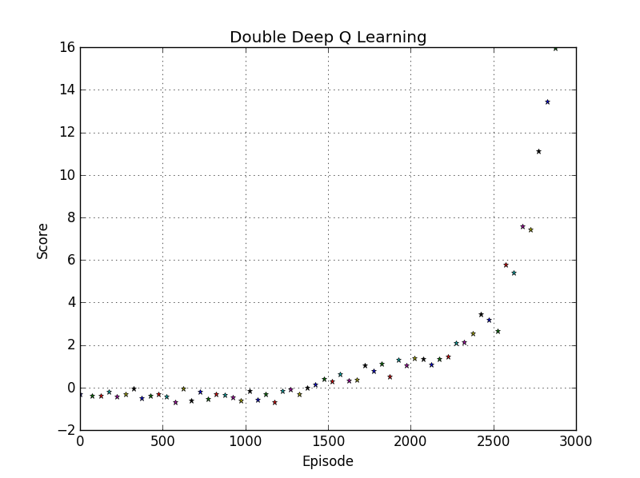

<br> The `average testing score is 22.4`

---

## Prioritized Experience Replay (PER)

I studied `Prioritized Experience Replay` with the paper [Prioritized Experience Replay](https://arxiv.org/abs/1511.05952)

In DQN algorithm, experience transition were uniformly sampled from a replay memory.

However, PER replays important transitions more frequently, and therefore learn more efficiently.

The `key idea` is the RL agent can learn more efficiently from some transitions than from others. 

The important transitions are measured by the `magnitude of their temporal difference (TD) error`

The equation of TD Error is as follows.

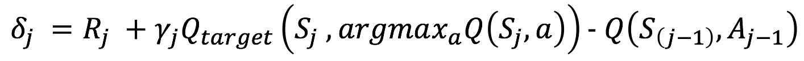


However, greedy TD-error prioritization has several issues. 

- Transitions that have a low TD-error on first visit may not be replayed for a long time 
- It is sensitive to noise spikes, which can be exacerbated by bootstrapping 
- Greedy prioritization focuses on a small subset of the experience: error shrinks slowly.


To overcome these issues, stochastic sampling method that interpolates between `pure greedy prioritization` and `uniform random sampling`. 

​For guaranteeing a non-zero probability even for the lowest-priority transition, it defines the `probability of sampling transition` i as

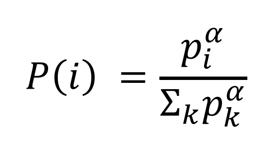

- p_i > 0 is the priority of transition i. 
- The exponential alpha determines how much prioritization is used, with alpha = 0 corresponding to the uniform case. 

To determine p_i, there are 2 ways.

1. Proportional Prioritization

   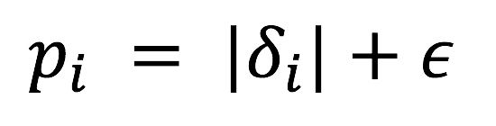

   - epsilon is a small positive constant that prevents the edge-case of the transitions not being revisited once their error is zero.
2. Rank-based Prioritization

   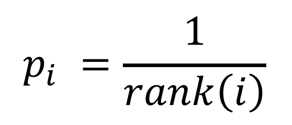

   - rank(i) is the rank of the transition i when the replay memory is sorted according to delta_i


The algorithm of the prioritized experience replay is as follows. 

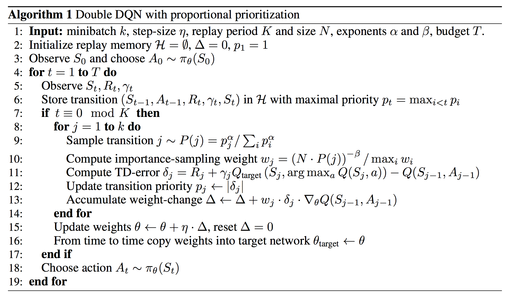

<br> I verified the algorithm with the game `breakout`. 

The graph of average score is as follows.

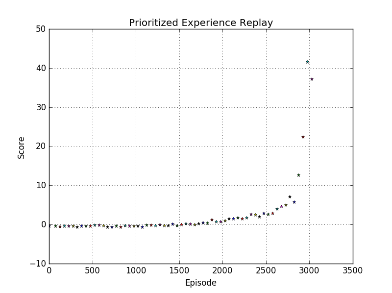

<br> The `average testing score is 40.44`!! Wow! :clap:

---

##Dueling Deep Q Network

I studied `Dueling Deep Q Network` with the paper [Dueling Network Architecture for Deep Reinforcement Learning](https://arxiv.org/abs/1511.06581).

This paper presents a new neural network architecture for model-free reinforcement learning. THis dueling network represents two separate estimators: 

- State value function
- Action advantage function

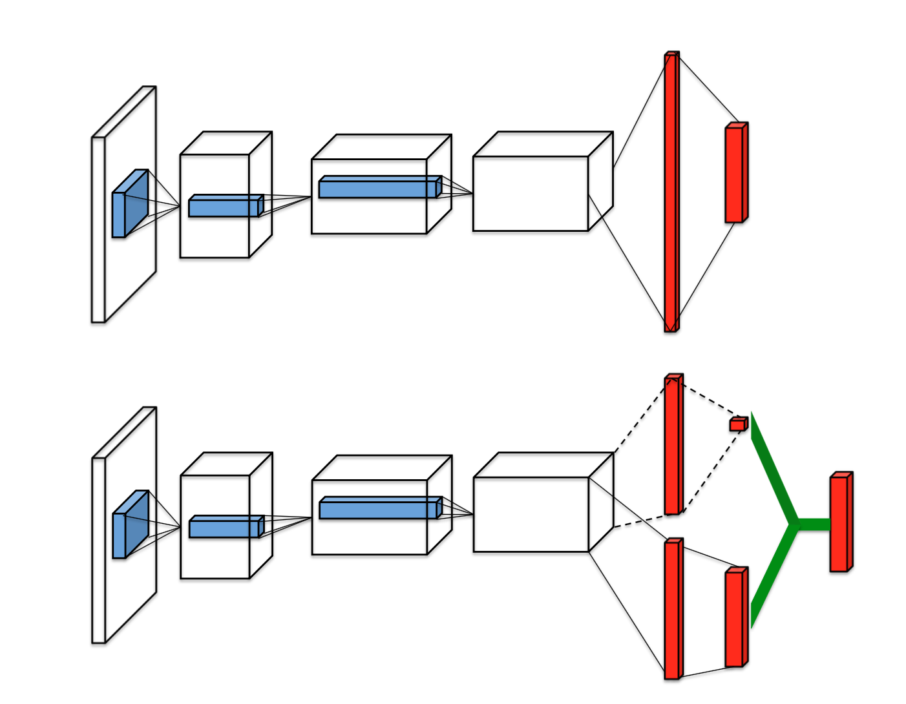

The image at the top is single stream DQN and image at the bottom is dueling DQN. Dueling network has 2 streams to separately estimate (scalar) state-value and the advantages for each action. After that combine them to get final Q-values as output.

The equation of Q-values is as follows. 

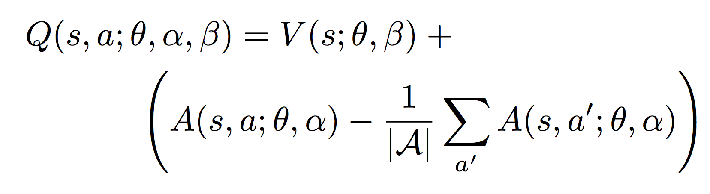

 The V (s; θ, β) is provides an estimate of the value function. Also, A(s, a; θ, α) is result of advantage stream. The advantage function subtracts the average value of the advantage function to obtain a relative measure of the importance of each action. 

The estimates V (s; θ, β) and A(s, a; θ, α) are computed automatically without any extra supervision or algorithmic modifications. Therefore, it is not difficult to implement this algorithm! :smile:


<br> I verified the algorithm with the game `breakout`. 

The graph of average score is as follows.

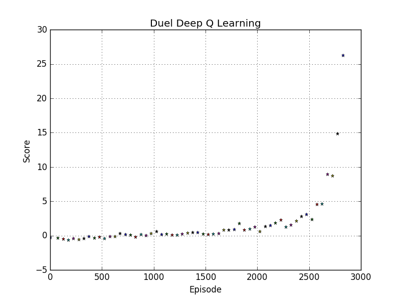

<br> The `average testing score is 35.29`

---

## Deep Recurrent Q Network (DRQN)

I studied `Deep Recurrent Q Network` with the paper [Deep Recurrent Q-Learning for Partially Observable MDPs](https://arxiv.org/abs/1507.06527).

This paper adds recurrency to a DQN by replacing the first post-convolutional fully-connected layer with a recurrent LSTM. Single image input cannot reveal time related information (e.g. velocity, direction, etc). Therefore, DQN algorithm stacks 4 time series images to get this kind of information. In this paper, it uses LSTM to get sequential information. 

As a result, it remembers events more distance than 4 screens in the past. Also, this algorithm better deals with `Partially-Observable Markov Decision Process (POMDP)` by leveraging advances in `Recurrent Neural Networks`.  

The architecture of the DRQN is as follows. 

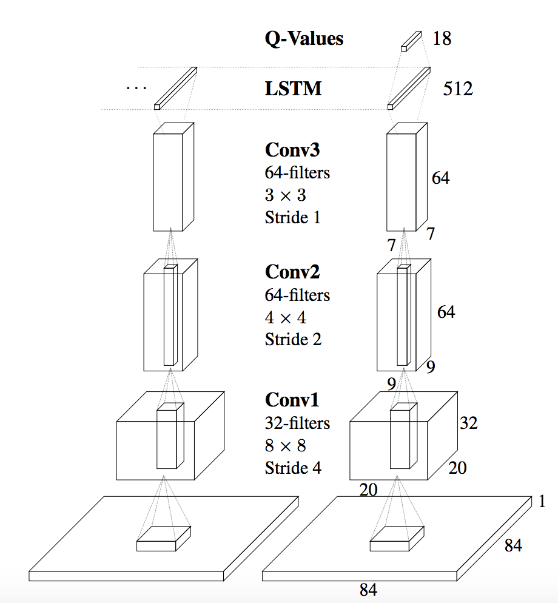


DRQN convolves three times over a single-channel image of the game screen. The resulting activations are
processed through time by an LSTM layer.  The last two timesteps are shown here. LSTM outputs become Q-Values after passing through a fully-connected layer. 


<br> I verified the algorithm with the game `breakout`. 

The graph of average score is as follows.

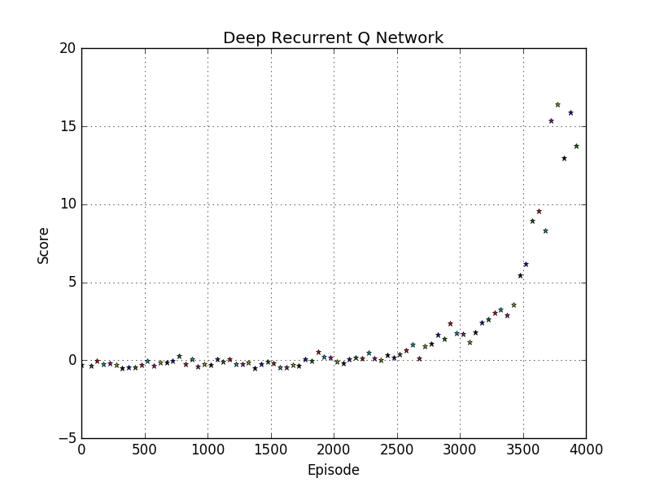

<br> The `average testing score is 14.92`

