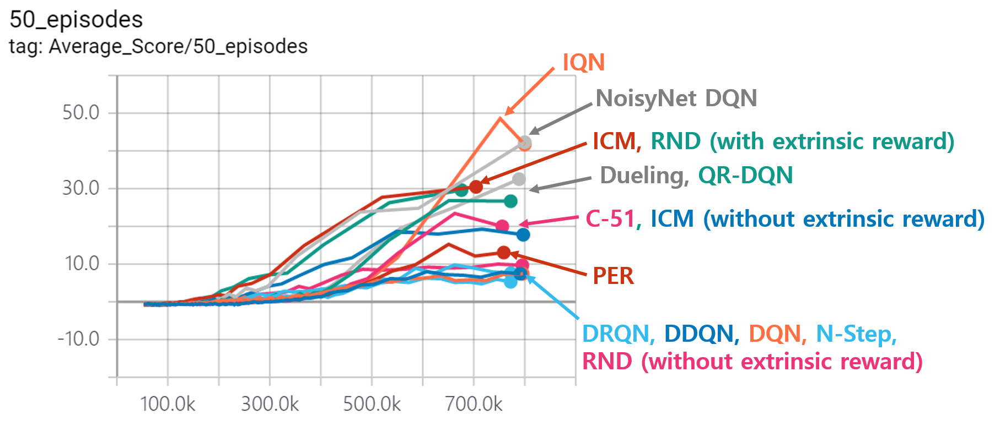

# DRL

## Introduction
This repository is the codes for `Deep Reinforcement Learning`
<br> I verified my codes with games. The games are made with `pygame`. I made the games or I modified them to apply for DRL. 

Also, environments, which are made by `Unity ML-agents` are in  [Unity_ML_Agent Repository](https://github.com/Kyushik/Unity_ML_Agent)

<br> I set up the DQN code as follows. 

* [Human-level Control Through Deep Reinforcement Learning](https://storage.googleapis.com/deepmind-media/dqn/DQNNaturePaper.pdf)
* [Deep Reinforcement Learning with Double Q-Learning](https://arxiv.org/abs/1509.06461)
* [Prioritized Experience Replay](https://arxiv.org/abs/1511.05952) 
* [Dueling Network Architecture for Deep Reinforcement Learning](https://arxiv.org/abs/1511.06581)
* [Deep Recurrent Q-Learning for Partially Observable MDPs](https://arxiv.org/abs/1507.06527) 
* [Noisy Networks for Exploration](https://arxiv.org/abs/1706.10295) 
* [A Distributional Perspective on Reinforcement Learning (C51)](https://arxiv.org/abs/1707.06887) 
* [Distributional Reinforcement Learning with Quantile Regression(QR-DQN)](https://arxiv.org/abs/1710.10044)
* [Implicit Quantile Networks for Distributional Reinforcement Learning(IQN)](https://arxiv.org/abs/1806.06923)
* [Curiosity-driven Exploration by Self-supervised Prediction](https://arxiv.org/abs/1705.05363)
* [Continuous Control with Deep Reinforcement Learning](https://arxiv.org/abs/1509.02971)  -> Working! 


This is the [PPT file](https://www.dropbox.com/s/0o72oqe7f5kip4z/DQN.pdf?dl=0) for the `description of DQN codes` that I implemented. 


Performance of each algorithm that I implemented are as follows (verified with `Breakout`).  



[Youtube Link of Playing Breakout with NoisyNet DQN](https://youtu.be/h8UtVZ5XCtY)


#### The description of DRL algorithms

[Description of algorithms link](https://github.com/Kyushik/DRL/blob/master/README_Algorithms.md)

<br>

---
## Environment
**Software**
* Windows7 (64bit)
* Python 3.5.2
* Anaconda 4.2.0
* Tensorflow-gpu 1.3.0
* pygame 1.9.3
* opencv3 3.1.0

**Hardware**
* CPU: Intel(R) Core(TM) i7-4790K CPU @ 4.00GHZ

* GPU: GeForce GTX 1080

* Memory: 8GB

  <br>

---
## Implementation
The sample code for my environment is `Environment_sample.py`

```python
# This is sample code for Deep Reinforcement Learning testing environment 

# Import modules
import sys 
import numpy as np
import random

# Import games
sys.path.append("DQN_GAMES/")

# add as game the one that you want to play!! 
import pong as game
import dot  
import dot_test  
import tetris  
import wormy
import breakout

# Get Number of action and name of game from the game code
Num_action = game.Return_Num_Action()
game_name = game.ReturnName()

# Get game state class from game code
game_state = game.GameState()

while True:
    # Choose random action
    action = np.zeros([Num_action])
    action[random.randint(0, Num_action - 1)] = 1.0

    # You can get next observation, reward and terminal after action
    observation_next, reward, terminal = game_state.frame_step(action)
```

You can run the game with random action using this code!! 


Please check that you made the folder for saved variables

```
checkpoint = tf.train.get_checkpoint_state("saved_networks_DQN")
```

Then you are ready to implement the code! :laughing:

<br>

---
## Games 
Most of the games are made with python and pygame! 

The codes are easy to understand and variables are easy to understand. 

So fix the code as you want!! :laughing: 


#### Description of the games

[Specific description of games](https://github.com/Kyushik/DRL/blob/master/README_Games.md)