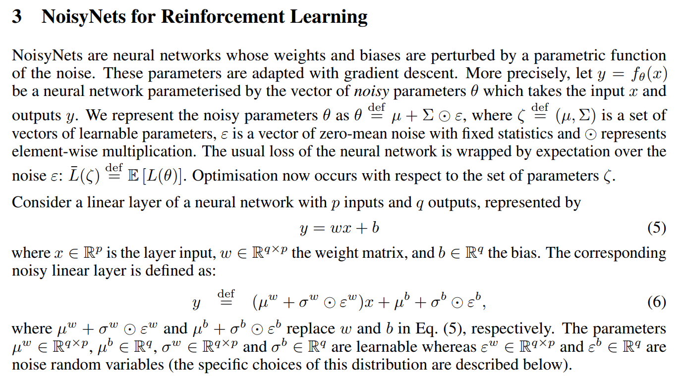
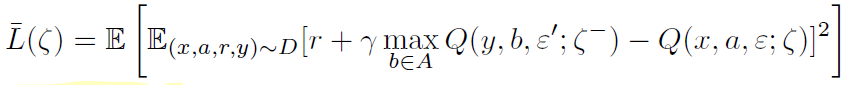
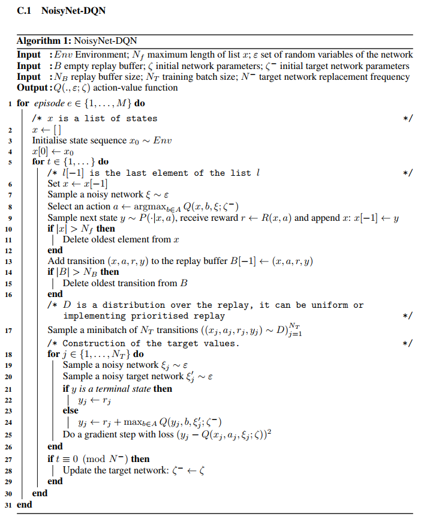

# DRL Algorithms

------

## Deep Q Network (DQN)

I studied `Deep Q Network` with the famous paper [Human-level control through deep reinforcement learning](http://www.nature.com/nature/journal/v518/n7540/full/nature14236.html) from Deep mind and `deep q network code` from [github of asrivat1](https://github.com/asrivat1/DeepLearningVideoGames).
After, I studied DQN and made my own code. 

  I verified the code with the game `breakout`. 

The graph of average score is as follows.

  The `average testing score is 11.14`

Each point is the average score of 50 games. 
  The graph shows that as the training progresses, the average score increases.
  I think it shows that DQN algorithm works well. 😃 

Also, the `average testing score is 18.43`

------

## Double Deep Q Network (DDQN)

I studied `Double Deep Q Network` with the paper [Deep Reinforcement Learning with Double Q-learning](https://arxiv.org/abs/1509.06461)

> The main idea of this algorithm is from `Double Q Learning` (van Hasselt, 2010).
> This algorithm uses two sets of weights, θ and θ'.
>   For each update, one set of weights (θ) is used to determine the greedy policy and the other (θ') is to determine its value.
>   The paper said, we can decouple the `selection` from the `evaluation` with this method.
>   This makes less likely to select overestimated values. 

  As a result, the difference between DQN and DDQN at each update is as follows.

  

  

  I verified the code with the game `breakout`. 

The graph of average score is as follows.

  The `average testing score is 11.77`

------

## Prioritized Experience Replay (PER)

I studied `Prioritized Experience Replay` with the paper [Prioritized Experience Replay](https://arxiv.org/abs/1511.05952)

In DQN algorithm, experience transition were uniformly sampled from a replay memory.

However, PER replays important transitions more frequently, and therefore learn more efficiently.

The `key idea` is the RL agent can learn more efficiently from some transitions than from others. 

The important transitions are measured by the `magnitude of their temporal difference (TD) error`

The equation of TD Error is as follows.

However, greedy TD-error prioritization has several issues. 

- Transitions that have a low TD-error on first visit may not be replayed for a long time 
- It is sensitive to noise spikes, which can be exacerbated by bootstrapping 
- Greedy prioritization focuses on a small subset of the experience: error shrinks slowly.

To overcome these issues, stochastic sampling method that interpolates between `pure greedy prioritization` and `uniform random sampling`. 

For guaranteeing a non-zero probability even for the lowest-priority transition, it defines the `probability of sampling transition` i as

- p_i > 0 is the priority of transition i. 
- The exponential alpha determines how much prioritization is used, with alpha = 0 corresponding to the uniform case. 

To determine p_i, there are 2 ways.

1. Proportional Prioritization

   

   - epsilon is a small positive constant that prevents the edge-case of the transitions not being revisited once their error is zero.

2. Rank-based Prioritization

   

   - rank(i) is the rank of the transition i when the replay memory is sorted according to delta_i

The algorithm of the prioritized experience replay is as follows. 

  I verified the algorithm with the game `breakout`. 

The graph of average score is as follows.

  The `average testing score is 21.02`!! Wow! 👏

------

## Dueling Deep Q Network

I studied `Dueling Deep Q Network` with the paper [Dueling Network Architecture for Deep Reinforcement Learning](https://arxiv.org/abs/1511.06581).

This paper presents a new neural network architecture for model-free reinforcement learning. THis dueling network represents two separate estimators: 

- State value function
- Action advantage function

The image at the top is single stream DQN and image at the bottom is dueling DQN. Dueling network has 2 streams to separately estimate (scalar) state-value and the advantages for each action. After that combine them to get final Q-values as output.

The equation of Q-values is as follows. 

 The V (s; θ, β) is provides an estimate of the value function. Also, A(s, a; θ, α) is result of advantage stream. The advantage function subtracts the average value of the advantage function to obtain a relative measure of the importance of each action. 

The estimates V (s; θ, β) and A(s, a; θ, α) are computed automatically without any extra supervision or algorithmic modifications. Therefore, it is not difficult to implement this algorithm! 😄

  I verified the algorithm with the game `breakout`. 

The graph of average score is as follows.

  The `average testing score is 17.73`

------

## Deep Recurrent Q Network (DRQN)

I studied `Deep Recurrent Q Network` with the paper [Deep Recurrent Q-Learning for Partially Observable MDPs](https://arxiv.org/abs/1507.06527).

This paper adds recurrency to a DQN by replacing the first post-convolutional fully-connected layer with a recurrent LSTM. Single image input cannot reveal time related information (e.g. velocity, direction, etc). Therefore, DQN algorithm stacks 4 time series images to get this kind of information. In this paper, it uses LSTM to get sequential information. 

As a result, it remembers events more distance than 4 screens in the past. Also, this algorithm better deals with `Partially-Observable Markov Decision Process (POMDP)` by leveraging advances in `Recurrent Neural Networks`.  

The architecture of the DRQN is as follows. 

DRQN convolves three times over a single-channel image of the game screen. The resulting activations are
processed through time by an LSTM layer.  The last two timesteps are shown here. LSTM outputs become Q-Values after passing through a fully-connected layer. 

  I verified the algorithm with the game `breakout`. 

The graph of average score is as follows.

  The `average testing score is 13.84`

------

## NoisyNet Deep Q Network

I studied `Noisy Deep Q Network` with the paper [Noisy Networks for Exploration](https://arxiv.org/abs/1706.10295).

This algorithm is a deep reinforcement learning agent with parametric noise added to its weights. The parameters of the noise are learned with gradient descent along with the remaining network weights. 

- NoisyNet learned perturbations of the network weights are used to drive exploration.
- Noise is added to the policy at every step.
- The perturbations are sampled from a noise distribution.
- The variance of the perturbations is a parameter that can be considered as the energy of the injected noise.
- Variance parameters are learned using gradients from the reinforcement learning loss function.
- Epsilon greedy is no longer used, but instead the policy greedily optimises the value function.

In the paper, description of the NoisyNet is as follows. It replaces the linear layers by noisy layers.

There are more variables for NoisyNet (`mu` and `sigma`). Therefore, the loss function of algorithms is also changed. DQN loss becomes the NoisyNet-DQN loss as follows.

Outer expectation is with respect to distribution of the noise variables *epsilon* for the noisy value function Q(x, a, epsilon; zeta) and the noise variable *epsilon`* of the noisy target value function Q(y, b, epsilon`;target zeta).

The algorithm from the paper is as follows. 

  I verified the algorithm with the game `breakout`. 

The graph of average score is as follows.

  The `average testing score is 41.73!!` wow!  

