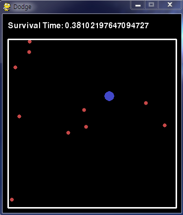

# Description of the Games 
### **Pong**

  

This is `Pong game` which is one of the most famous DRL example.
I write this code with pygame. 

Rule

- Red bar: Agent  /  Blue bar: Enemy
- Actions: Up, Down, Stay (3 actions)
- Enemy never lose the game! 
- If agent hit the ball, get +1 reward / If agent lose, get -1 reward
- If agent hit the ball 10 times then game is finished

### **Breakout**

  

This is `Break out` which is one of the most famous DRL example.
I write this code with pygame. 

Rule

- Red bar: Agent  /  Blue bar: Enemy

- Actions: left slow, left fast, Stay, right slow, right fast (5 actions)

- If ball breaks one block, get +1 reward

- If ball get to the ground, get -1 reward

- If agent breaks all of the blocks get +11 points!! (total 60 points)

  ​

### **Tetris**

  

Original tetris game code is from [invent with pygame](http://inventwithpython.com/pygame) 
 Wrapped version of game code is from [github of asrivat1](https://github.com/asrivat1/DeepLearningVideoGames)

Rule

- Simple tetris rule!

- Actions: right, left, down, down to bottom, rotate 90 degree, rotate -90 degree (6 actions)

- If make one complete line then get +1 reward / Setting - reward is still in progress

  ​

### **Wormy**

  

Original tetris game code is from [invent with pygame](http://inventwithpython.com/pygame) 
  I made DQN version of game code my own

Rule

- Simple wormy rule!

- Actions: right, left, forward (3 actions)

- If worm eat apple(red square) then gets +1 reward. 

- If worm hit the wall or eat himself gets -1 reward

  ​

### **Dodge**

  

This is my own version of dodge which is made by `pygame`

Rule

- Blue circle is agent and little red dots are enemy
- Actions: up, down, left, right, stay (5 actions)
- If red dot hits blue circle then gets -1 reward. 
- If blue circle stays alive, gets +0.01 reward.

Dodge the red dot and stay alive!! :smile:

### **Dot**

  

I made this game to evaluate my DQN code. 
 Rule is very simple. Blue square is agent, Red square is enemy(- reward), Green diamond is food(+ reward)
 So blue square needs to evade red square and get the green diamond. 
 You can change the difficulty and maps in the code. 

### **Dot mini**

  

This is simple version of Dot. 
